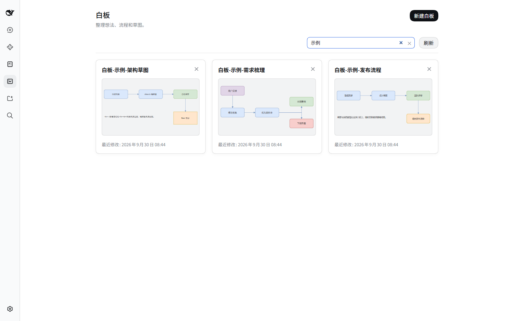
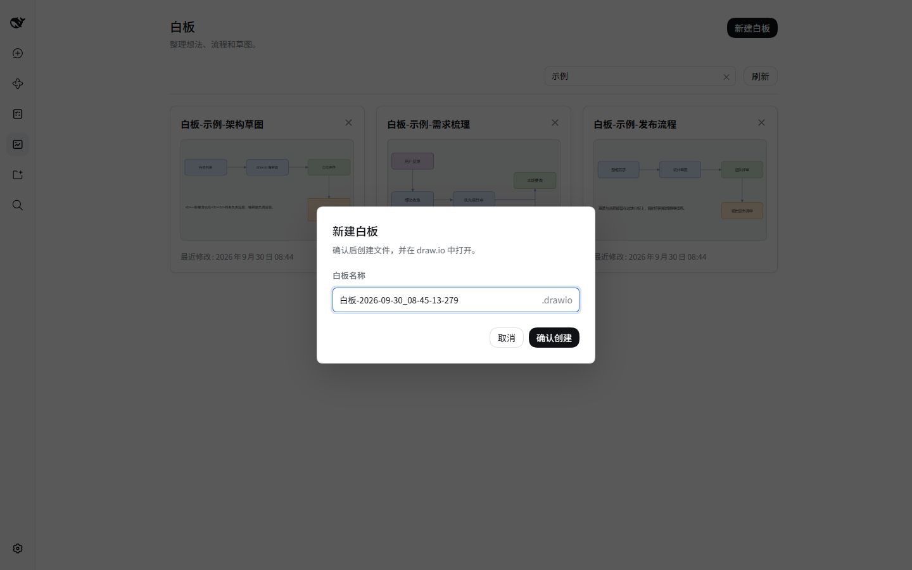
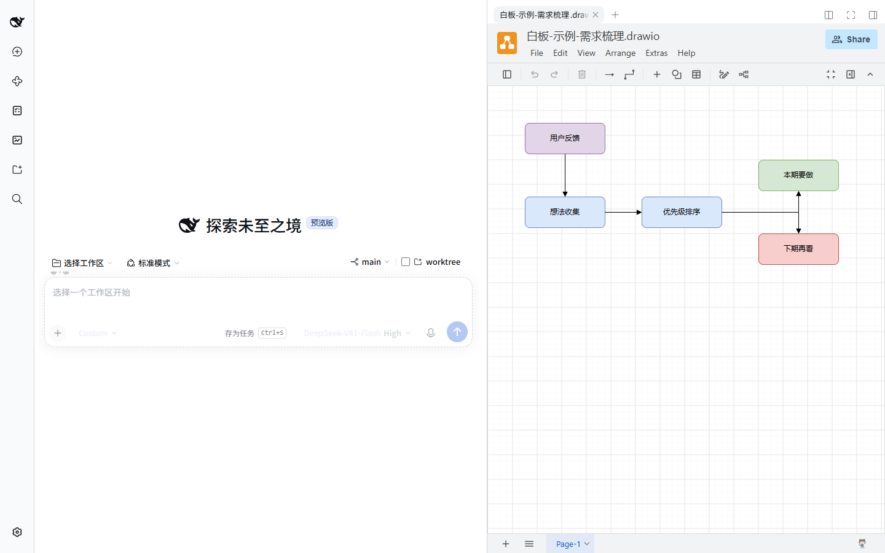

# dsh-whiteboard

English | [中文](README.zh.md)

## Why I built this plugin

I often need somewhere to jot down drafts while thinking. I used to do that in documents, but now that AI tools are part of my everyday workflow, I wanted that space right inside DeepSeek Harness. A whiteboard is more flexible for sketching ideas and mapping out processes. It uses the open `.drawio` file format, so boards can also be edited in draw.io and other compatible tools.

In the plugin list, display names and descriptions follow the Harness language setting in English or Chinese (English is the default fallback); English names use the package name without its npm scope, Chinese names describe the purpose, and installation still uses the unchanged real package name.

## Screenshots







The editor screenshot shows an earlier version. The current version keeps the gallery visible beside the editor.

## Install

Install the editor dependency first, then the whiteboard plugin:

```sh
npx @deepseek-ai/dsh plugin --profile web add @guowenzhang/dsh-drawioedit
npx @deepseek-ai/dsh plugin --profile web add @guowenzhang/dsh-whiteboard
```

Restart DSH Web, open **Whiteboards** in the left navigation, and click **New whiteboard** to confirm a name and get started. Click an existing card to continue editing.

## Notes

- The editor saves your drawings automatically; no manual saving is needed.
- Boards are stored in the plugin's `files/` directory, not the current workspace. Back up that directory before updating, replacing, or uninstalling the plugin.
- Deleting a board removes its file, so check before confirming.

## License

[Apache-2.0](LICENSE). See [NOTICE](NOTICE) for third-party notices.
